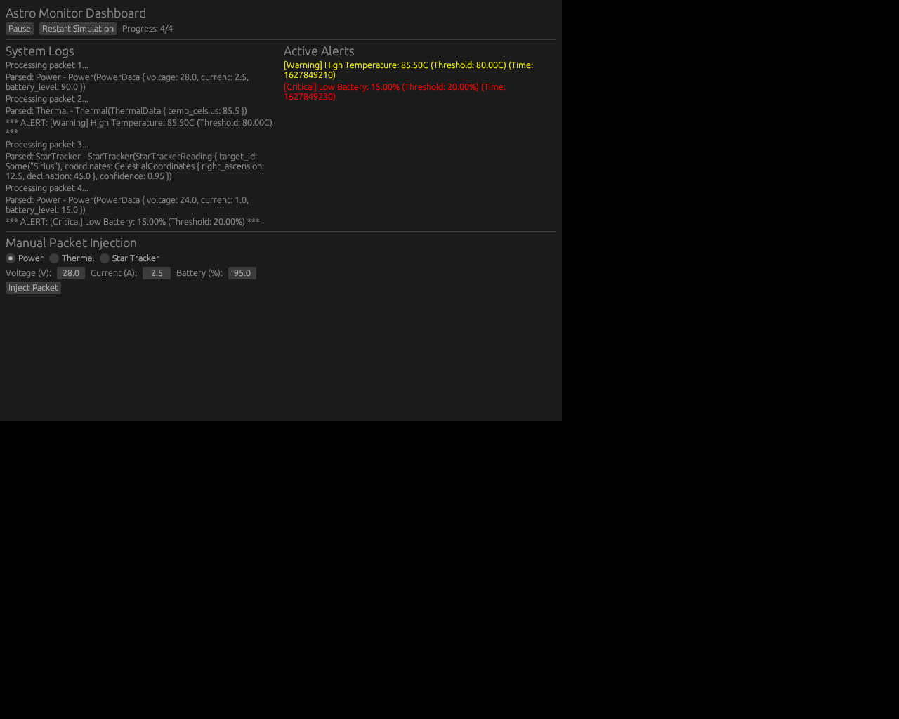

# AstroMonitor


**AstroMonitor** is a high-performance telemetry monitoring system designed for spacecraft subsystems. It simulates, parses, and analyzes telemetry packets from various subsystems including Power, Thermal, and Attitude & Orbit Control Systems (AOCS).

The application features a **Graphical User Interface (GUI)** for real-time visualization, simulation control, and manual data injection.



## Features

- **Graphical Dashboard**: Visualizes system logs and active alerts in real-time.
- **Multi-Subsystem Support**: Handles telemetry for Power, Thermal, AOCS, and StarTracker subsystems.
- **Real-time Parsing**: Efficiently parses binary telemetry packets.
- **Automated Monitoring**: Analyzes data streams to detect anomalies such as:
  - Low Battery Levels
  - High Thermal Readings
  - Low Star Confidence
- **Simulation Control**: Pause, Resume, and Restart the telemetry simulation.
- **Manual Packet Injection**: Manually input telemetry values (e.g., Voltage, Temperature, Coordinates) to inject custom packets for testing.

## Getting Started

### Prerequisites

- [Rust](https://www.rust-lang.org/tools/install) (latest stable version)
- Cargo (comes with Rust)

**Linux Requirements:**
On Linux, you need to install the following development libraries for the GUI:

```bash
sudo apt-get install libxcb-render0-dev libxcb-shape0-dev libxcb-xfixes0-dev libxkbcommon-dev libssl-dev
```
*(Note: Exact packages may vary by distribution. Using `eframe`/`egui` typically requires generic graphics libraries.)*

### Installation

Clone the repository:

```bash
git clone https://github.com/dhruvhaldar/AstroMonitor.git
cd AstroMonitor
```

### Usage

To launch the GUI application:

```bash
cargo run
```

The dashboard will open, showing the simulation progress.
- Use the **Pause/Resume** and **Restart** buttons to control the flow.
- Use the **Manual Packet Injection** panel at the bottom to test specific scenarios.

## Project Structure

- `src/main.rs`: Entry point, launches the GUI application.
- `src/gui.rs`: Implements the GUI dashboard, event loop, and manual injection logic.
- `src/models.rs`: Defines data structures for Subsystems and Telemetry.
- `src/monitor.rs`: Logic for analyzing packets and generating alerts.
- `src/parser.rs`: Handles the deserialization of raw binary data into structured packets.
- `src/simulation.rs`: Generates simulated binary telemetry packets.

## License

This project is licensed under the MIT License - see the [LICENSE](LICENSE) file for details.
